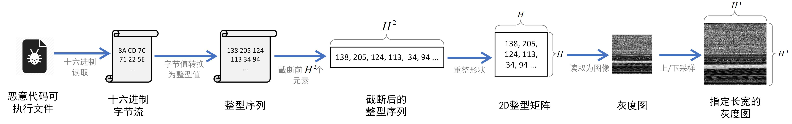
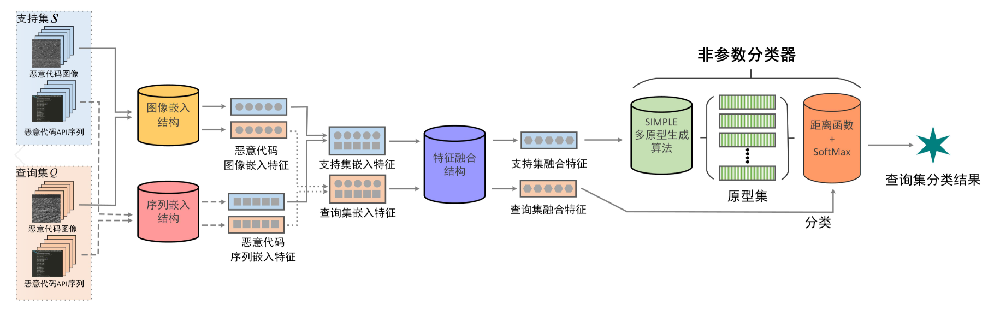
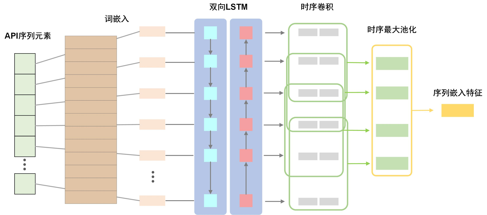
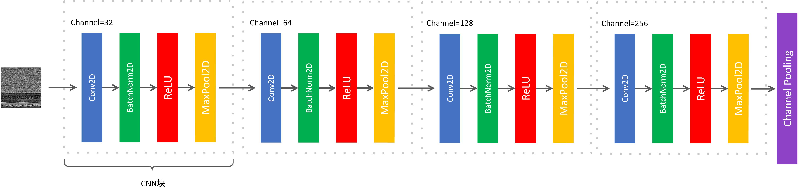

# MalFusionFSL
(For an English version of README can turn to [README_en](https://github.com/Asichurter/MalFusionFSL/blob/main/README_en.md) (under construction))

基于静态/动态分析特征融合的小样本恶意代码分类框架(few-shot malware classification based on fused analysis features)的研究代码。
包含所有数据集处理，元学习任务级封装，提出模型和基线模型的细节实现，训练/测试的运行代码等。本项目的特点包括：

- **高度封装的低耦合模型分层实现**：模型可以通过继承包含基础功能的父类来获得一些模型无关的基础能力，例如序列和图像嵌入，任务参数的解析等，使得新模型可以快速地进行开发
- **高度封装的episode元学习任务采样**：将元学习任务采样封装到task实例中，方便自定义采样规则和利用接口自动采样任务batch
- **完全参数化的模型训练和模型测试**：完全使用易读的JSON配置文件来指定模型的内部参数，例如隐藏层维度，超参数的设定，训练周期等，确保同等配置下的实验效果的可复现性
- **模块化的模型架构解析**：使用高度封装的builder接口来获取模型，优化器，特征融合模块等架构部件，隔离了运行脚本对部件的改动的感知，使得新模型添加或者模型改动可以很容易快速完成
- **详细的运行时和测试时数据记录**：使用dataset+version的方式来管理训练和测试运行实例，使得每一次运行都有训练/测试记录保存，方便后续统计实验效果或者复盘
- **丰富的参数支持**：大量的运行时参数允许调整，例如Visdom可视化，控制台打印运行情况log，梯度裁剪和GPU指定等
- **自动化任务运行支持**：支持使用自动执行机来流水线施添加预定运行任务，使得模型训练测试可以自动无人值守时完成

本项目中用到的动静态数据和一些基本的数据处理和模型结构可以参考以下论文：
- 静态分析数据：恶意程序二进制转灰度图，见: <br/>_Tang, Z.; Wang, P.; Wang, J. ConvProtoNet: Deep Prototype Induction towards Better Class Representation for Few-Shot Malware Classification. Appl. Sci. 2020, 10, 2847. https://doi.org/10.3390/app10082847_   
  - 数据集地址：https://drive.google.com/file/d/11XKYjyG0h54Du07bRk7r4aFhYyF4tcCb/view?usp=sharing
- 动态分析数据：Cuckoo沙箱运行恶意程序二进制文件获取的API调用序列，见：<br/> _Wang, Peng, Zhijie Tang, and Junfeng Wang. "A Novel Few-Shot Malware Classification Approach for Unknown Family Recognition with Multi-Prototype Modeling." Computers & Security (2021): 102273. https://doi.org/10.1016/j.cose.2021.102273_
  - 数据集地址：https://drive.google.com/file/d/1F5lTzn5_ubms288KPIImzb2dyBCS5ZB8/view?usp=sharing

## 运行环境
### 硬件环境
- CPU：Intel Core i7-9700F
- GPU：GTX 1660Ti 6GB
- 内存：16 GB

### 软件环境
- 操作系统：Majanro Linux KDE 20.2
- Python：3.8
- Cuda: 11.2
- Pip包（见requirement.txt）：
  - **PyTorch: 1.8.0 (cu111 ver. ,默认使用cuda运行)**
  - glove-python-binary: 0.2.0
  - numpy: 1.19.2
  - visdom: 0.1.8.9
  - matplotlib: 3.3.2
  - Pillow: 8.0.1
  - tqdm
  - gpustat

## 运行说明
本项目的正确运行依赖于若干前置准备工作，包括：数据处理和数据集制作，运行参数配置调整等。

### 数据集
本项目使用的数据集可以在Google Drive上进行下载：[virushare-20-fusion](https://drive.google.com/file/d/1F5lTzn5_ubms288KPIImzb2dyBCS5ZB8/view?usp=sharing)。该数据集已经经过了预处理，下载解压后就可以直接使用。如果您不想使用这个处理好的数据集，想要复现或者自定义数据处理过程，可以参考下下一节中的数据处理过程指导。

### 数据集结构
项目使用的原数据集为VirusShare_00177，可以在[VirusShare网站](https://virusshare.com/)下载得到。出于减少文件IO的想法，训练/测试过程都读取整块数据文件，而这些过程又依赖多个数据文件，这些文件都按照以下结构存放在以“数据集名字”为名的文件夹中，一个数据集对应一个文件夹。数据集文件夹整体的结构如下：

```
(数据集名称)
    |-- all 
        |-- img
        |-- api
    |-- train
        |-- img 
        |-- api 
    |-- validate
        |-- img 
        |-- api 
    |-- test
        |-- img 
        |-- api 
    |-- doc    
    |-- models
    |-- data
        |-- train
            |-- api.npy
            |-- img.npy
            |-- idx_mapping.json
            |-- seq_length.json
        |-- validate
            |-- api.npy
            |-- img.npy
            |-- idx_mapping.json
            |-- seq_length.json
        |-- test
            |-- api.npy
            |-- img.npy
            |-- idx_mapping.json
            |-- seq_length.json
        |-- wordMap.json
        |-- matrix.npy
```
其中各个文件/文件夹的用途如下：
- `all`：包含了训练集，验证集和测试集中所有图像和api数据，便于进行数据集划分和做预训练
- `train`：训练集。其下的img对应的是恶意代码灰度图数据，包含若干个文件夹，其中每一个文件夹以恶意代码家族命名，文件夹内的样本同属于该家族，api文件夹内同理，包含的家族与img内一一对应
- `validate`：验证集，结构与训练集相似，但是其中包含的恶意代码家族与训练集不相同
- `test`：测试集。结构与训练集和验证集相似，但是其中包含的恶意代码家族与前两者都不一样
- `doc`：存放训练时记录数据，每一次运行对应一个版本（version），以该版本为名，doc中的一个version对应一个文件夹，文件夹内包含该次运行的所有数据
- `models`：存放训练之后保存的模型，所有版本的模型不以文件夹区分，以命名区分，训练运行时也会保存，测试时从这里读取
- `data`：存放预处理的数据
  - `wordMap.json`: 对应API序列在预训练之后，每一个token对应的映射整型值，便于从字典矩阵中取出对应嵌入向量
  - `matrix.npy`: 预训练得到的API序列词嵌入字典，2D：[词数量, 维度]
  - `train`：包含训练集打包好的数据
    - `api.npy`：打包好的2D的API序列的token矩阵，其中每一个API序列都已经对齐到一个指定长度上（超过截断，不足补0），每一个API序列实际上是一个被映射的int值（与词嵌入的映射对应）。一次性读入内存减少IO等待
    - `img.npy`：打包好的3D的恶意代码图像矩阵，其中每一个图像都是一个指定的长宽（例如256×256）。一次性读入内存减少IO等待
    - `idx_mapping`：包含数据集中的恶意代码家族index与其对应的真实名称的映射
    - `seq_length`：API数据截断前的真实长度，用于RNN的pack和unpack，或者注意力中的mask
  - `validate`：包含验证集打包好的数据，结构与训练集中同理
  - `test`：包含测试集打包好的数据，结构与训练集中同理


### 数据集预处理（可选）
如果您下载了VirusShare网站的原生数据集，并选择要自己进行预处理过程，才需要阅读这一节，否则直接跳过这一节即可。
#### *标注恶意代码家族
由于下载的恶意代码源数据中没有家族标签，为了完成分类任务的监督学习需要对所有恶意代码样本进行标注，采用的标注方法是上传至[VirusTotal网站](https://support.virustotal.com/)进行扫描。扫描结果将会以JSON文件返回，内部包含了许多家公司的反恶意扫描引擎的扫描结果。由于各个公司的引擎之间的家族命名缺少一个统一的标准，因此需要使用[AVClass工具](https://github.com/malicialab/avclass)来从扫描结果中抽取一个唯一的家族名称作为恶意代码的ground-truth家族标签。最后统计家族数量的规模，只保留包含指定数目（实验中为20）以上个样本的家族，并将属于同一家族的样本收集到同一个文件夹中

#### *序列数据处理
具体方法可以见最上方的基于API序列的参考文献。所有序列数据由[Cuckoo沙箱](https://cuckoosandbox.org/)运行恶意代码二进制文件后得到。Cuckoo沙箱在运行二进制文件后，会自动生成一个运行报告，其中只留下API调用的名称组装成一个序列，丢弃其他所有特征，存储为一个JSON文件。注意，太短的运行序列（例如长度小于10）的样本需要被弃用，因为太短的序列没有包含太多有意义的信息，通常意味着运行失败。处理流程大致如下：

1. 移除API序列中重复调用超过2次造成的冗余子序列，只保留最多2次调用，可参考代码中 [preprocessing/normalization.py/removeAPIRedundancy](https://github.com/Asichurter/MalFusionFSL/blob/ec2f557ae8e896d1ecb4ea49920d8ec68ffbd6da/preprocessing/normalization.py#L5)
的实现。该操作会覆盖掉原序列文件中的数据，注意备份
3. 提取序列的N-Gram（实验中N=3）序列并统计各个N-Gram子序列的频率，只保留top-l（实验中l=5000）的N-Gram子序列。同时为了防止因为生成的N-Gram的名称过长，将每一个保留的N-Gram项映射为一个int值，最后利用top-l的N-Gram序列int映射值替换原API序列。可参考代码中 [preprocessing/ngram.py/statNGramFrequency,mapAndExtractTopKNgram](https://github.com/Asichurter/MalFusionFSL/blob/ec2f557ae8e896d1ecb4ea49920d8ec68ffbd6da/preprocessing/ngram.py#L6)
的实现，前者主要是统计N-Gram频率并生成频率排序字典，后者完成实际的映射工作，本操作也是一个in-place操作，会覆盖源数据
4. 对于每一个标注的恶意代码家族，从每一个家族中采样一个固定数量的样本（实验中是20）来组成数据集，放置到上一节中介绍的数据集结构中的*all/api/*中，文件夹名称就为家族名称。可参见代码中 [preprocessing/dataset/sample.py/sampleClassWiseData](https://github.com/Asichurter/MalFusionFSL/blob/ec2f557ae8e896d1ecb4ea49920d8ec68ffbd6da/preprocessing/dataset/sample.py#L12)
的实现
5. 对所有提取的序列数据运行GloVe算法来生成序列元素的词嵌入矩阵，可参见代码中 [utils/GloVe.py](https://github.com/Asichurter/MalFusionFSL/blob/main/utils/GloVe.py)中的实现，主要使用了glove-python库。生成的词嵌入矩阵向量存储为NumPy的NdArray类型，放置在 *data/matrix.npy*;”序列元素->矩阵下标值映射“存储为JSON类型，放置在*data/wordMap.json*下

#### *图像数据处理
具体方法可以参考最上方的基于恶意代码灰度图的参考文献。主要是利用16进制读取二进制文件后，按顺序将每一个字节值（2个十六进制数）转换为一个0-255的灰度值，整个字节序列就转换为灰度值序列。然后将灰度值序列按照最大的平方值进行截断，转换为一个2D的正方形图像，最后上采样/下采样至一个指定大小的图像（实验中是256×256）。处理好的图像数据保存在上一节中介绍的 *all/img/*中。可参考代码中 *preprocessing/image.py*的实现。



#### *数据集分割
由于元学习的特殊性，数据集分割需要将恶意代码家族（类）分割，而不是类中的样本。分割前所有恶意代码家族都位于 *all*文件夹中，分割时需要把整个家族的数据移动到train，validate或者test文件夹中，而且需要同时将API序列数据和恶意代码灰度图数据对应分割移动。具体的代码实现可以参考 [preprocessing/dataset/split.py/splitDataset](https://github.com/Asichurter/MalFusionFSL/blob/main/preprocessing/dataset/split.py)。分割后，训练集的所有数据位于 *train*文件夹中，验证集和测试集分别位于 *validate*和*test*文件夹中

#### *数据打包
为了减少因为文件IO造成的处理延时增加，在训练/测试之前都先将所需数据一次性读入内存中，因此需要将数据打包以方便读取。打包时按照数据子集为单位（train，validate，test）为单位，每一个子集采用相同的打包方式，数据分别存储在数据集中 *data*目录下不同子集的文件夹中。

对于序列数据，打包过程主要包括：
- 对齐序列长度：指定一个序列最大长度t，对于长度超过*t*的序列做截断操作，对长度小于*t*的序列使用0填充到指定长度
- 统计序列长度：统计每一个序列的实际长度，以便于LSTM模型进行pack和unpack操作。长度文件存储为 *seqLength.json*
- 映射序列元素到词嵌入下标：使用词嵌入时生成的wordMap.json，将序列数据映射为词嵌入的下标数据，以便于词嵌入读取
  
序列数据打包好以后命名为 *api.npy*，放置在对应的子集文件夹下

对于图像数据，打包过程主要包括：
- 向量化图像：读取图像文件并将其转换为一个PyTorch的Tensor类型
- 标准化图像：按像素点统计所有图像数据的灰度均值和方差，利用均值和方差标准化图像
  
图像数据处理好以后命名为 *img.npy*，放置在对应的子集文件夹下

为了保证恶意代码家族的具体的可追溯性，在每一个子集打包时，每一个恶意代码家族在打包矩阵中的下标存储为 *idx_mapping.json*，放置在对应的子集文件夹下

## 参数说明
本项目的所有运行和模型超参数均使用JSON配置文件来配置（不使用运行参数）。通过配置 *config/train.json* 和 *config/test.json* 可以灵活地控制训练和测试过程中的各种参数细节，例如使用的数据集，多模态混合类型，嵌入backbone的隐藏层维度和层数，训练epoch，优化器和学习率调度器等等。运行时模型将会完全从配置文件中读取配置参数（而不会接受任何的命令行参数）来进行运行配置。每运行一次训练，训练的参数配置*config/train.json*将会保存至对应数据集doc文件夹中对应version的文件夹中，保证后续复盘时了解训练的详细配置。

### 训练过程配置
- **配置使用的数据集和数据源，或只启用静态/动态分析**
  - `"task | dataset"`：训练/测试使用的数据集,同名数据集文件夹必须出现在 `config/env.json/platform-node` 对应的 `DatasetBasePath` 路径下
  - `"training | data_source"`: list类型，指定训练/测试使用的数据源，合法值包括："sequence"(启用基于API序列的动态分析，读取data下的api.npy,seq_length.json等),"image"(启用静态分析，读取data下的img.npy)，也可以同时指定两者来启用混合分析
  - `"model | fusion | type"`: 如果只使用sequence或者image数据源的其中一个，即非混合分析，需要将混合类型指定为对应的sequence或者image
- **配置使用的模型**
  - `"model | model_name"`: 模型的名称，需要注册在builder中，详见[builder/model_builder.py](https://github.com/Asichurter/MalFusionFSL/blob/main/builder/model_builder.py)
- **配置训练过程的任务参数**
  - `"task | k/n/qk"`: 组成一个k-shot n-way任务的episode的参数，分别代表支持集中每个类的样本数量，任务包含的类数量和查询集中每个类的样本数量
  - `"task | version"`: 标识本次运行的版本数，用于保存模型在model文件夹中和保存训练配置和训练结果在doc文件夹中，同一数据集的同一版本会相互覆盖
- **配置cuda**
  - `"task | device_id"`: 配置训练过程中cuda使用的GPU编号，目前仅支持单GPU，从0开始
- **配置训练周期**
  - `"traininig | epoch"`: 最大训练周期，一个epoch对应一个episode任务
- **配置特征融合模块**
  - **配置使用的特征融合类型**
    - `"model | fusion | type"`: 使用的特征融合类型，如果只使用一种特征而非混合特征需要设置为sequence或者image。合法值参见[builder/fusion_builder.py](https://github.com/Asichurter/MalFusionFSL/blob/main/builder/fusion_builder.py) 
  - **配置双线性混合模块( `"fusion | params"` 下)**：
    - `"bili_norm_type"`, `"bili_affine"`, `"bili_non_linear"`，`"bili_dropout"`: 双线性融合中使用的标准化方法(详见[builder/normalization_builder.py](https://github.com/Asichurter/MalFusionFSL/blob/main/builder/normalization_builder.py))，是否使用仿射变换，使用的非线性激活函数(详见[builder/activation_builder.py](https://github.com/Asichurter/MalFusionFSL/blob/main/builder/activation_builder.py))，使用的dropout率
  - **配置基于注意力机制的混合模块( `"fusion | params"` 下)**
    - `"att_dropout"`, `"att_scale_factor"`: 注意力机制中的dropout比例和softmax注意力系数生成时的指数缩放因子
  - **配置基于MLP的混合模块( `"fusion | params"` 下)**
    - `"dnn_hidden_dims"`, `"dnn_activations"`, `"dnn_dropouts",` `"dnn_norm_type":` MLP逐层的隐藏层维度/激活函数/dropout比例，最终的标准化方法。激活函数和标准化方法的合法值见上方链接
  - **"配置输出维度( `"fusion | params"` 下)"**
    - `"output_dim"`: 类型无关的通用输出维度
- **配置图像嵌入模块( `"conv_backbone"` 下)**
  - **配置图像嵌入类型**
    - `"type"`: 使用的图像嵌入模型类型，目前支持: "conv-4"(普通2D卷积层)，"resnet-18"和"resnet-34"。可以通过在[model/common/base_embed_model.py](https://github.com/Asichurter/MalFusionFSL/blob/main/model/common/base_embed_model.py)中进行添加来支持更多模型
  - **配置conv-n( `*"params | conv-n"*` 下)**
    - `"global_pooling"`: 是否在卷积完成后，使用全局池化方法来以卷积feature map为单位进行池化
    - `"global_pooling_type"`: feature map 池化方法，默认max pooling
    - `"channels"`: 2D卷积层的通道数量，第一个默认为1（输入图像为1通道灰度图），后续通道数量与卷积层层数有关，默认4层
    - `"kernel_sizes/padding_sizes/strides/nonlinears"`: 2D卷积层的逐层卷积核大小/填充大小/卷积步幅/激活函数，数量需要与层数保持一致，默认4层
    - `"out_type"`: 特征输出的形状类型，可以展平feature_map输出，也可以以特征块的方式输出，合法值为"flatten"获"patch"（如果开启了global_pooling，则默认会以flatten方式输出，此处配置无效）
    - `input_size`：输入的正方形图像尺寸，默认为随机裁剪的224
- **配置序列嵌入模块( `"sequence_backbone"` 下)**
  - **配置序列嵌入类型**
    - `"seq_type"`: 序列嵌入模型的类型，目前仅支持"LSTM"，可以在[model/common/base_embed_model.py](https://github.com/Asichurter/MalFusionFSL/blob/main/model/common/base_embed_model.py)  下增加更多模型支持
  - **配置LSTM( `*"params | LSTM"* `下)**
    - `"bidirectional"`: 是否使用双向LSTM
    - `"hidden_size"`: LSTM隐藏层维度（目前不支持逐层控制）
    - `"layer_num"`: LSTM层数
    - `"dropout"`: LSTM层之间的dropout比例（如果只有一层将会出现警告，不影响模型任何性能）
    - `"modules | self_attention"`: 使用自注意力来约减向量序列为单一特征向量，使用"enabled"来控制是否开启，详见[comp/nn/reduction/selfatt.py](https://github.com/Asichurter/MalFusionFSL/blob/main/comp/nn/reduction/selfatt.py)
    - `"modules | self_attention"`: 使用时序卷积来约减向量序列为单一特征向量，使用"enabled"来控制是否开启，详见[comp/nn/reduction/CNN.py](https://github.com/Asichurter/MalFusionFSL/blob/main/comp/nn/reduction/CNN.py)。默认使用时序卷积
- **配置序列/图像特征嵌入后重投影( `"model | reproject"` 下)**
  
  重投影将会把序列和图像嵌入后的特征分别使用不同的投影矩阵投影到相同的维度上，是某些要求维度相同的特征融合（例如逐位相加）的必须
  - `"enabled"`: 是否启用重投影
  - `"params | out_dim"`: 输出维度
  - `"params | non_linear"`: 使用的激活函数
- **配置训练时模型验证( `*"validate"*` 下)**
  - `"val_cycle"`: 经过多少epoch训练，将会在验证集上运行一次训练模型来验证模型泛化能力
  - `"val_epoch"`: 每一次验证运行多少个epoch
  - `"metrics"`: 验证过程中监测的指标，支持: "acc", "precision", "recall", "f1"
  - **配置基于验证结果的提前终止( `"early_stop"` 下)**
    - (验证效果好于最佳验证效果，将会保存当前模型到models文件夹下)
    - `"criteria"`: 提前终止的性能衡量标准，合法值："metric","loss" (使用metric时，将会默认使用第一个metric作为标准，如果要修改这个下标选择，参见[utils/manager.py/StatKernel的criteria_metric_index](https://github.com/Asichurter/MalFusionFSL/blob/fcccd24c6353f6fc9c1100b10c1e1700e2d633f0/utils/manager.py#L121))
    - `"save_latest"`: 是否默认总是会保存一份最新的模型，命名中含有"_latest"
- **配置优化器和学习率调度器( `"optimize"` 下)**
  - `"loss_function"`: 损失函数，目前仅支持"nll"（交叉熵损失）和"mse"（平均平方误差）
  - `"optimizer"`: 优化器，目前仅支持"sgd"和"adam"，可以在[builder/optimizer_builder.py](https://github.com/Asichurter/MalFusionFSL/blob/main/builder/optimizer_builder.py)中添加更多待选优化器
  - `"momentum"`: 优化器动量值
  - `"default_lr"`: 默认学习率
  - `"custom_lrs"`: 字典类型，按module的key来逐个module指定学习率，没有指定的module按照默认学习率
  - `"weight_decay"`: 优化器中的权重衰减值，约等于l2正则化
  - `"task_batch"`: 任务batch大小，每次训练的epoch将会在多少个episode上同时进行一次优化
  - **配置学习率调度器( `"scheduler"` 下)**
    - `"type"`: 调度器类型，目前仅支持"step"步数调度器，可以设置为None来不指定调度器，参见[builder/scheduler_builder.py](https://github.com/Asichurter/MalFusionFSL/blob/main/builder/scheduler_builder.py)来扩展更多待选调度器
    - `"lr_decay_iters"`: 学习率衰减周期
    - `"lr_decay_gamma"`: 学习率每次衰减的衰减系数
- **配置训练过程可视化( `*"visualization"*` 下)**
  - `"enabled"`: 是否开启可视化监测。默认使用visdom来监测accuracy和loss两个指标，需要开启visdom服务
  - 其他参数不在此详细展开，可参见[builder/plot_builder.py](https://github.com/Asichurter/MalFusionFSL/blob/main/builder/plot_builder.py)和[utils/plot.py](https://github.com/Asichurter/MalFusionFSL/blob/main/utils/plot.py)
- **配置其他参数**
  - **配置模型特有参数( `"model | model_features"` 下)**
    - `"feat"`: FEAT模型专用参数，包括"集合-集合"函数类型，对比损失比例，适应前平均还是适应后平均，等
  - **配置SIMPLE的聚类参数( `"model | cluster"` 下)**
    - `"cluster_num_step"`: 最大聚类运行循环数
    - `"SIMPLE_init_sigma"`: SIMPLE的初始sigma值
  - **配置辅助损失值( `"model | more"` 下)**
    - `"aux_loss_seq_factor / aux_loss_img_factor"`: 序列/图像的辅助损失系数
    - `"aux_loss_learnable"`: 是否使用可学习的辅助损失系数
  - **配置序列的词嵌入( `"model | embedding"` 下)**
    - `"use_pretrained"`: 是否使用预训练好的词嵌入初始化嵌入矩阵
    - `"embed_size"`: 词嵌入的向量长度
    - `"word_count"`: 如果不使用预训练好的词嵌入初始化，而使用随机初始化的词的总数量。使用预训练时可以忽略该参数

### 测试参数配置
与训练中含义相同的配置项，例如 `"task | k/n/qk"`, `"task | dataset"` 等不再敷述，只介绍train.json中没有的参数项
- `"test_epoch"`: 测试周期数
- `"report_iter"`: 测试运行时每经过多少轮会报告当前结果在控制台
- `"data_source"`: 同train.json里面的 `"training | data_source"` ，但是可以指定为null来默认使用对应版本的训练时数据源
- `"load_type"`: 要测试的模型类型，是最好验证效果模型（对应"best"）还是最终模型训练完成以后保存的模型（对应"last"）
- `"verbose"`: 是否打印结果在控制台
- `"fine-tuning"`: 微调用参数，目前尚未使用     

## 模型说明（可选）
（如果您想更加详细地了解模型实现细节，可以选择阅读本节内容，否则可以选择直接跳过）

模型整体包括API序列嵌入结构，图像嵌入结构，特征融合模块和多原型生成算法，其中模型整体结构的运行流程结构如下所示（运行一个episode）：



### 基础模型 BaseModel
基础模型包含所有模型都需要的一些基础能力，还声明了一些所有模型都需要的数据，例如损失函数，数据源，特征融合输出维度等。基础模型的代码实现参见 [model/common/base_model.py/BaseModel](https://github.com/Asichurter/MalFusionFSL/blob/main/model/common/base_model.py)

基础模型包含的功能包括：
- 解析数据中的Episode任务参数（K，C，N等）
``` python
    def _extractEpisodeTaskStruct(self,
                                  support_seqs, query_seqs,
                                  support_imgs, query_imgs):
        if support_seqs is not None:
            k = support_seqs.size(1)
            n = support_seqs.size(0)
        elif support_imgs is not None:
            k = support_imgs.size(1)
            n = support_imgs.size(0)
        else:
            assert False, "[extractEpisodeTaskStruct] 序列和图像的支持集都为None，无法提取n,k"
    # ...
```
- 调用嵌入结构嵌入序列和图像嵌入结构来嵌入输入数据，主要是按次序调用SeqEmbedPipeline和ImgEmbedPipeline，因此后续模型嵌入具体实现需要将组建放入这两个列表中
```python
    def embed(self,
              support_seqs, query_seqs,
              support_lens, query_lens,
              support_imgs, query_imgs):
        self._extractEpisodeTaskStruct(support_seqs, query_seqs,
                                       support_imgs, query_imgs)
        k, n, qk, w = self.TaskParams.k, self.TaskParams.n, self.TaskParams.qk, self.ImageW

        if support_seqs is not None:
            support_seqs = support_seqs.view(n * k, -1)
            support_seqs = self._seqEmbed(support_seqs, support_lens) 
            query_seqs = self._seqEmbed(query_seqs, query_lens)
            
        if support_imgs is not None:
            support_imgs = support_imgs.view(n*k, 1, w, w)
            support_imgs = self._imgEmbed(support_imgs)    
            query_imgs = self._imgEmbed(query_imgs).squeeze()

        return support_seqs, query_seqs, support_imgs, query_imgs
```

### 嵌入模型 BaseEmbedModel
嵌入模型继承了基础模型BaseModel，主要增加了模型需要的数据嵌入功能，能够根据配置参数来调整模型的实际使用子结构和超参数。嵌入模型的代码实现见 [model/common/base_embed_model.py/BaseEmbedModel](https://github.com/Asichurter/MalFusionFSL/blob/main/model/common/base_embed_model.py)

嵌入模型的包含的功能包括：
- 根据数据源配置嵌入结构：如果数据源中不包括序列数据，则在初始化嵌入结构时不会初始化序列数据的嵌入结构，以减少显存开销。数据源的配置可以在训练参数配置文件 *config/train.json*中的**training | data_source**中设置
``` JSON
{
      "training": {
        "data_source": [
            "sequence",
            "image"
        ]
    }
}
```
- 设置词嵌入初始化的使用：可以选择使用或者不使用词嵌入，在**model | embedding**中设置
```JSON
{
  "model": {
    "embedding": {
      "use_pretrained": true,
      "embed_size": 300,
      "word_count": null
    },
  }
}
```
- 设置序列嵌入结构和其超参数：在**model | sequence_backbone**中调整序列嵌入的参数，默认使用**LSTM+时序卷积最大池化**作为序列嵌入结构。
```JSON
{
  "model": {
    "sequence_backbone": {
      "seq_type": "LSTM",
      "max_seq_len": 300,
      "LSTM": {
          "bidirectional": true,
          "hidden_size": 128,
          "layer_num": 1,
          "dropout": 0.5,
          "modules": {
              "self_attention": {
                  "enabled": false,
                  "type": "custom",
                  "params": {
                      "self_att_dim": null,
                      "multi_head_att_head_num": 4
                  }
              },
              "temporal_conv": {
                  "enabled": true,
                  "params": {
                      "kernel_sizes": [3],
                      "paddings": [1],
                      "relus": [true],
                      "pools": ["ada"],
                      "bn": [true]
                  }
              }
          }
      }
  }
}
```
可以通过该参数下的"type"子参数来调整其他结构（需要在BaseEmbedModel中实现）。序列长度通过参数下的**max_seq_len**来调整。其他参数，例如LSTM类型的参数，包括在了该参数下的"LSTM"子项，包括双向LSTM，隐藏层维度，LSTM层数等。如果需要实现新的模型，则参数可以自定义调整，只需要在BaseEmbedModel中自行判断读取即可，默认图像嵌入结构示意图如下所示

- 设置图像嵌入结构和其超参数：在**model | conv_backbone**中调整图像嵌入的参数，默认使用**Conv-4**结构作为图像嵌入结构。
```JSON
{
  "model": {
            "conv_backbone": {
            "type": "conv-4",
            "params": {
                "conv-n": {
                    "global_pooling": true,
                    "global_pooling_type": "max",
                    "input_size": 224,
                    "out_type": "patch",
                    "channels": [1,32,64,128,256],
                    "kernel_sizes": [3,3,3,3],
                    "padding_sizes": [1,1,1,1],
                    "strides": [2,1,1,1],
                    "nonlinears": [true,true,true,true]
                }
            }
        }
  }
}
```
可以通过该参数下的“type"子参数来调整为其他结构，目前已实现的还有resnet18和resnet34，其他结构可以自行在BaseEmbedModel中判断并添加即可。Conv-4内的参数，包括是否使用global_pooling来将 *batch,channel,dimension* 形式的图像特征约减为一个特征向量，每一个卷积层的通道数量，卷积步幅stride，填充padding，是否使用非线性激活等，都包含在子参数**params | conv-n**中，如果需要自行实现新的模型和其参数，则在"params"下新加一个子参数项，然后在BaseEmbedModel初始化时自行读取即可。整个Conv-4图像嵌入结构如下所示:

- 将序列嵌入和图像嵌入流程放入嵌入管道：按顺序将序列数据的嵌入子结构放入SeqEmbedPipeline中，将图像数据的嵌入子结构放入ImgEmbedPipeline中。例如，典型的一个序列嵌入管道为: self.Embedding -> self.EmbedDrop -> self.SeqEncoder -> self.SeqTrans
- 设置重投影模块：在序列和图像数据嵌入后分别使用两个线性层，重投影两部分特征到一个共同的维度上，可以用于统一两个特征的维度，也可以用于两个特征空间的重组。重投影的参数设置如下：
```JSON
{
  "model": {
    "reproject": {
        "enabled": false,
        "params": {
            "out_dim": 256,
            "non_linear": "relu"
        }
    }
  }
}
```
- 初始化特征融合模块：根据参数中的**model | fusion | type**初始化对应的特征融合模块。主要调用了buildFusion接口，见 [builder/fusion_builder.py/buildFusion](https://github.com/Asichurter/MalFusionFSL/blob/main/builder/fusion_builder.py)

